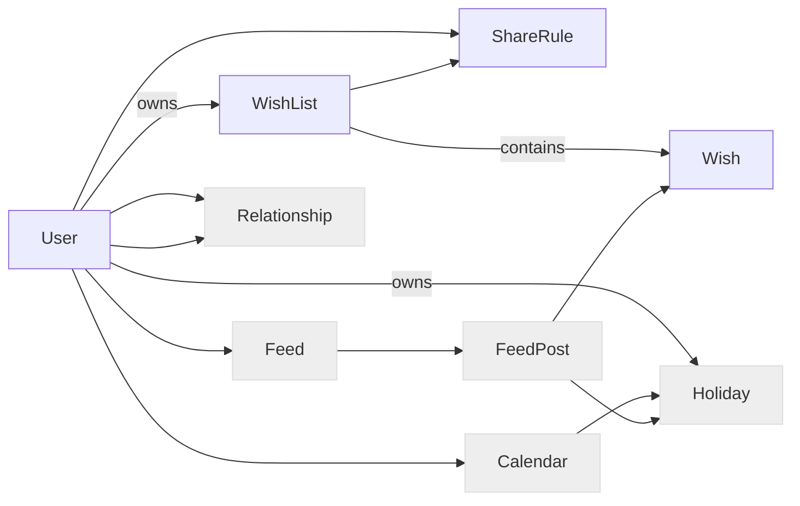
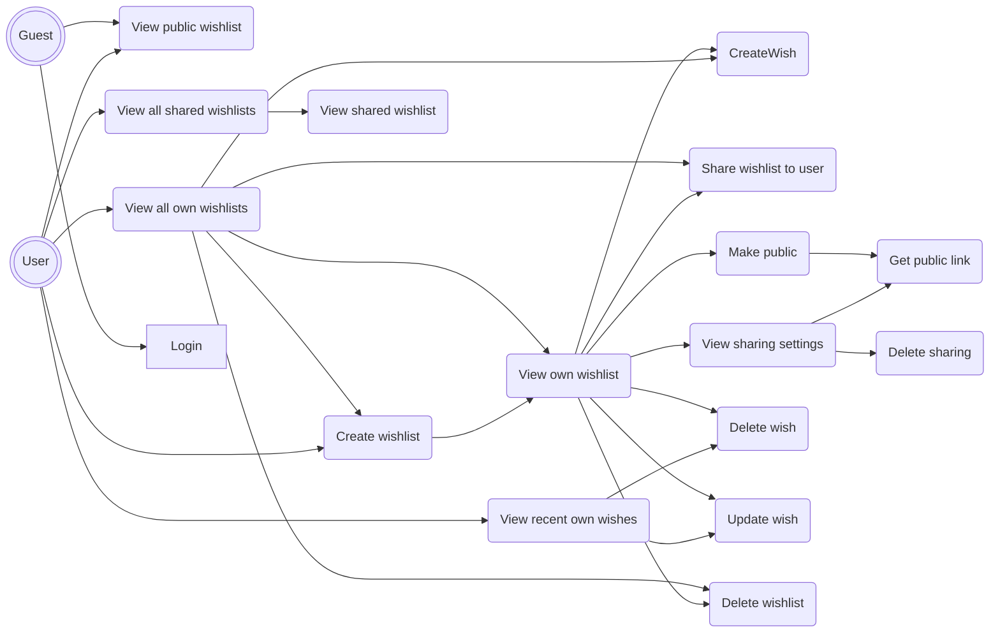

## Deseos17
### Project description

Application for wish list management with telegram bot and web ui

### Models

Blue models are to be implemented now
Gray models are planned and need to be clarified

### Use cases

