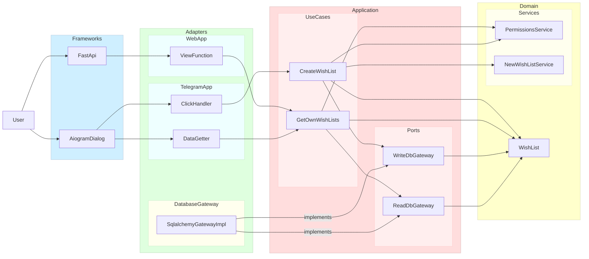

### Implementation details

Application tries to follow clean architecture and is divided by layers:

[**Domain**](/src/deseos17/domain) - contains main [models](/src/deseos17/domain/models) used by application and related [common business logic](/src/deseos17/domain/services) like checking permissions, fields value generation and models relationship. As for now, models are anemic and implemented using dataclasses. Services are plain functions. Domain implementation can be approved by replacing service functions with classes and then with aggregates. 

[**Application**](/src/deseos17/application) - contains more specific logic related to user actions. It calls domain services and interacts with adapters. To do this each service contains `DTO` classes and `Gateway` protocols which are just combinations of multiple common protocols. Each use case is an implementation of generic UseCase-protocol: it contains single method with DTO in and DTO out. All use case dependencies are passed to constructor. 

**Adapters** - can be divided to controllers/views and gateways. Controllers call use cases and gateways are used by use cases to access external services. Currently, no implementation provided. Adapters are to be glue between use cases and externals libs or services. We are going to have mock implementations for tests purposes  

**Frameworks** - external libs and objects related to them. Here we can have FastApi with Routers, aiogram-dialog with Windows and so on.

